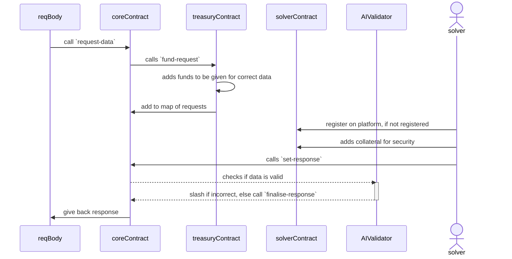

# <br/>BOO - Bitcoin Optimistic Oracle
An implementation of an Optimistic Oracle on Stacks, enabling the secure retrieval of arbitrary off-chain data through a propose-and-dispute mechanism enhanced with AI-driven validation for accuracy and reliability. \
Established oracle providers such as [Pyth](https://www.pyth.network/price-feeds) and [DIA](https://www.diadata.org/) offer robust mechanisms for retrieving real-world data, with a primary focus on price feeds across various asset classes including cryptocurrencies, equities, commodities, and foreign exchange rates. \
BOO provides oracle data with it incorporates a built-in incentive model that rewards participants for fulfilling requests or providing data, fostering a self-sustaining ecosystem through tokenized payments and reducing reliance on external subsidies.

## How it Works?
This section provides a detailed explanation of the oracle's architecture and functionality within our Web3 ecosystem, ensuring secure and reliable data integration from off-chain sources to on-chain smart contracts


## How to use it?
To access external data, call the `request-data` function in the contract where you need the data. After submitting your request, wait for it to be resolved. Once resolved, you can retrieve the data using the corresponding `req-id`; the returned struct’s `response` field will contain the requested data. \
```clarity
(define-data-var id uint u0) ;; Make sure this gets changed

(define-constant ERR_INNER_SOMETHING (err u800))
(define-constant ERR_OUTER_SOMETHING (err u801))

(define-public (some-function-from-other-contract)
    (ok (var-set id
        (-
            (unwrap!
                (unwrap!
                    (contract-call? .boo-core-v0_0_1 request-data
                        "something"
                        u100000  ;; Reward
                    )
                    ERR_INNER_SOMETHING
                )
                ERR_OUTER_SOMETHING
            )
            u1
        )))
)
```
Wait until the request is resolved; after that, you can use the retrieved data in your contract as follows:
```clarity
(define-data-var id uint u0)

...

(define-read-only (get-resp)
    (let (
            (resp (contract-call? .boo-core-v0_0_1 get-data id))
            (maybe-tuple (unwrap! resp ERR_UNAUTHORIZED))
                        { unwrap!: maybe-tuple }
        )
        (ok (get response tuple))
    )
)
```
