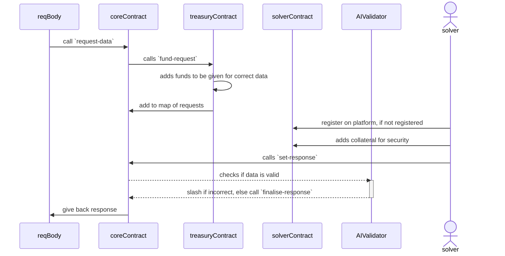

# BOO - Bitcoin Optimistic Oracle
An implementation of Optimistic Oracle on Stacks, allowing you to get any off chain data with AI validation.

# Workflow
This section provides a detailed explanation of the oracle's architecture and functionality within our Web3 ecosystem, ensuring secure and reliable data integration from off-chain sources to on-chain smart contracts

